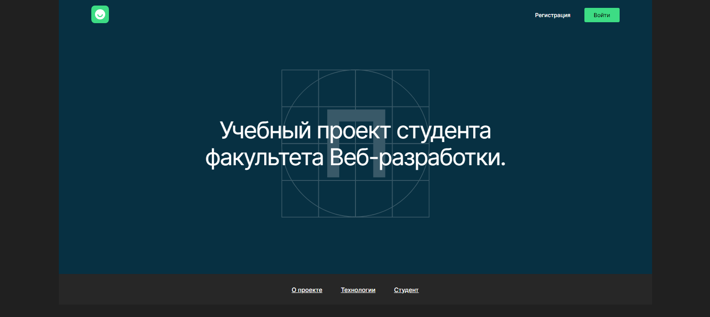
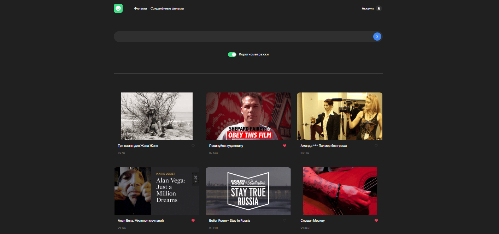
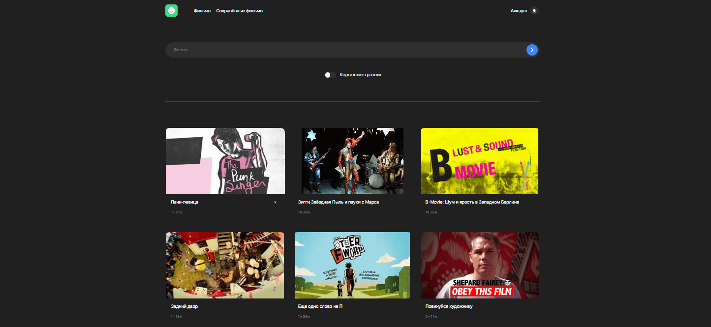

# ***Проект Movies-explorer (frontend) 🎬***
Проект является **дипломной работой** на курсе веб-разработчик ***Яндекс.Практикума***.
## *📜 Описание*
----
### ***О чём проект?***

Данное веб-приложение является сайтом-портфолио и мини-кинопоиском, открывающимся после регистрации, на котором пользователи могут искать фильмы по ключевым словам и добавлять их в избранное в личном кабинете.

### *Screenshot*

### 🎨 Ссылка на макет: https://www.figma.com/file/t6JkEKU08dpdPefAPd2dtf/dark-3?type=design&node-id=891-3857&mode=design
### *Функциональность:*

* **Регистрация** и **авторизация** пользователей
* **Защищённость роутов** (нельзя перейти к фильмам, если не выполнена авторизация)
* Реализована **валидация** всех форм/полей ввода с использованием регулярных выражений
* Возможность **поиска** фильмов со стороннего API
* Сохранение/удаление фильмов к себе в аккаунт
* Реализован **фильтр** короткометражных фильмов
* **Запоминание состояния** полей ввода в форме поиска фильмов, фильтра короткометражных фильмов и найденных фильмов (при обновлении страницы или переходе на другую страницу данные не будут утеряны)
* **Поиск фильмов** как на русском, так и английском языке вне зависимости от регистра букв
* Реализована **демонстрация ошибок** сервера или некорректных введённых данных
* При загрузке данных показывается **прелоадер**. По окончанию загрузки он скрывается
* Реализован **респонсив** для всех популярных разрешений экрана
* **Бургерное меню** для мобильной и планшетной версии и его закрытие по **оверлею** или по клавише **Esc**
* Переход к показу трейлера фильма при нажатии на постер
* Показ данных о фильме при наведении курсора на постер
* Приложение свёрстано по **БЭМ** с соблюдением **семантики**
* На странице поиска фильмов по клику на кнопку **"Ещё"** - показываются дополнительные фильмы (на роуте с сохранёнными фильмами показываются сразу **все** фильмы)
* Возможность редактирования своего профиля (почты и имени)
* Реализована **микроанимация** всех ссылок и кнопок
* Для создания сеток используется **flex** и **grid**
* Все данные хранятся на сервере, использовано стороннее и собственное API

## *Чеклист*:
+ [Критерии оценки диплома веб-разработчика](https://code.s3.yandex.net/web-developer/static/new-program/web-diploma-criteria-2.0/index.html#jsx)

## *Планы по доработке:*
* Реализовать сохранение токена в cookie

## *🚀 Установка и запуск проекта*:
Клонировать репозиторий https: `git clone https://github.com/Sibisov-Artem/movies-explorer-frontend.git`
Клонировать репозиторий ssh: `git clone git@github.com:Sibisov-Artem/movies-explorer-frontend.git`

Установить зависимости: `npm ci`

Запустить приложение: `npm run start`

Backend проекта располагается [тут](https://github.com/Sibisov-Artem/movies-explorer-api).

## *🛠 Стек*

  

  

  

  

  

  

  

<!-- ## Фронтенд: https://a-sibisov.nomoreparties.co  -->
<!-- ## Backend: https://api.a-sibisov.nomoreparties.co -->
